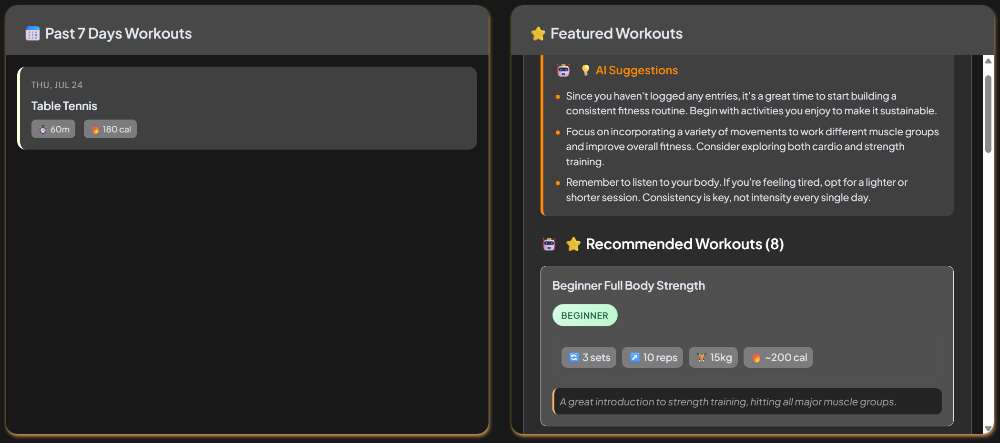

<div align="center">
  <a href="https://www.fitsage.tech">
    
  </a>
</div>

<div align="center">
  <h1>FitSage</h1>
  <h4>Your Smart Fitness Diary & Workout Companion</h4>
</div>

[](https://www.fitsage.tech)

[](https://nextjs.org)
[](https://supabase.com)
[](https://ai.google.dev/gemini)

---

FitSage is a minimal, modern fitness web app that transforms your natural workout diaries into structured insights and recommendations. Built for casual exercisers who want clarity and guidance without the hassle of complex data entry.

## Why We Built This

Most fitness apps overwhelm users with complex data entering or make tracking feel like a chore. We wanted something different - an app that understands you're just trying to stay active, not become a data scientist.

The idea was simple: what if you could just write about your workout like you're talking to a friend, and the app would figure out the rest? That's what FitSage does. It takes your casual diary entries and turns them into structured workout data, progress insights, and helpful suggestions - all powered by AI.

## Features

- **AI-Powered Diary**: Write freely without worrying about grammar, get structured workout summaries and suggestions in seconds
- **Smart Workout Recognition**: Recognizes 40+ workout types from casual mentions to structured exercises
- **Progress Visualization**: Simple charts showing your activity patterns and trends
- **Personalized Suggestions**: AI-generated tips based on your actual workout history
- **Personal Dashboard**: See your intensities, body stats, and recent workouts at a glance
- **Secure Authentication**: Quick, safe sign-in and sign-out process

## Snapshots

<div align="center">
  
  <p><em>Introduction page</em></p>
</div>
<div align="center">
  
  <p><em>AI-powered suggestions and workout recommendations</em></p>
</div>
<div align="center">
  
  <p><em>Structured workout summaries from natural diary entries</em></p>
</div>

## Quick Start

### Prerequisites

- Node.js 18+
- npm or yarn
- Supabase account (free tier works great)
- Google Gemini API key

### Installation

1. **Clone this repo**

   ```bash
   git clone https://github.com/rickytang666/fitsage.git
   cd fitsage
   ```

2. **Install dependencies**

   ```bash
   npm install
   ```

3. **Set up environment variables**
   Create a `.env.local` file in the root directory:

   ```env
   NEXT_PUBLIC_SUPABASE_URL=your_supabase_url
   NEXT_PUBLIC_SUPABASE_ANON_KEY=your_supabase_anon_key
   SUPABASE_SERVICE_ROLE_KEY=your_supabase_service_role_key
   GOOGLE_GENAI_API_KEY=your_gemini_api_key
   ```

4. **Set up your database**

   - Create a new Supabase project
   - Run the SQL from `database/schema.sql` in your Supabase SQL editor

5. **Run locally**

   ```bash
   npm run dev
   ```

6. **Open your browser**
   Navigate to `http://localhost:3000`

### Environment Setup Details

- **Supabase**: Used for authentication and data storage. The free tier includes 500MB database and 50,000 monthly active users.
- **Google Gemini**: Powers the AI features. The 2.5 Flash Lite model is fast and cost-effective for this use case.

## Tech Stack

| Category       | Technology                      |
| -------------- | ------------------------------- |
| **Frontend**   | Next.js, Tailwind CSS, Chart.js |
| **Backend**    | Supabase (auth, database)       |
| **AI**         | Google Gemini 2.5 Flash Lite    |
| **Deployment** | Vercel                          |

## Contributing

Contributions and feedback are welcome! Please feel free to submit a Pull Request.

## Roadmap

- **Voice Input**: Enable voice input for diary entries
- **Light/Dark Mode**: Add light/dark mode toggle
- **Date Filtering**: Better UX for viewing historical data
- **Smart Recommendations**: Intelligent YouTube video suggestions based on your workouts
- **Mobile App**: Native iOS/Android apps for better mobile experience

## License

MIT Licensed © [FitSage](https://www.fitsage.tech)

---

<div align="center">
  <p>Built with 💪 for fitness community</p>
  <p><a href="https://www.fitsage.tech">Try FitSage</a></p>
</div>
